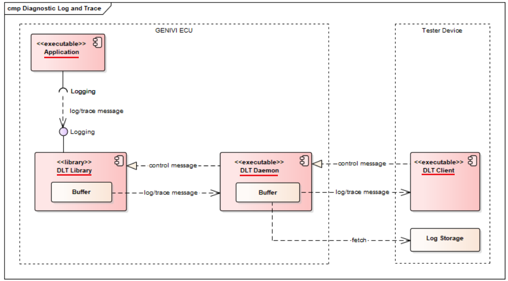
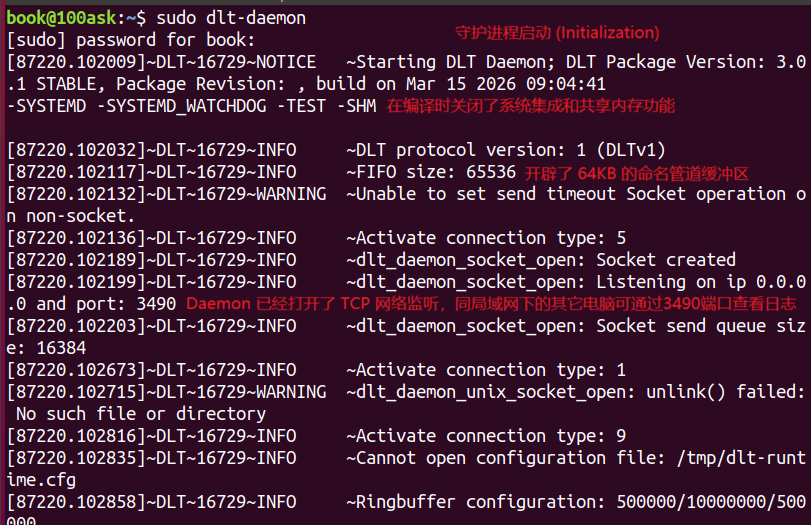
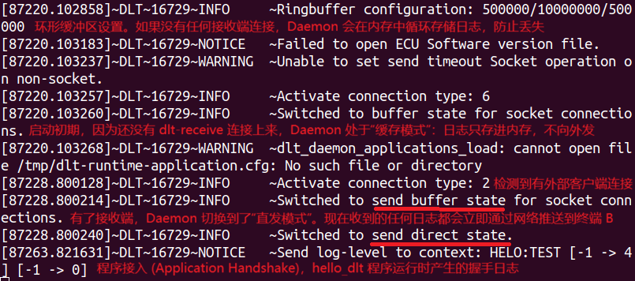
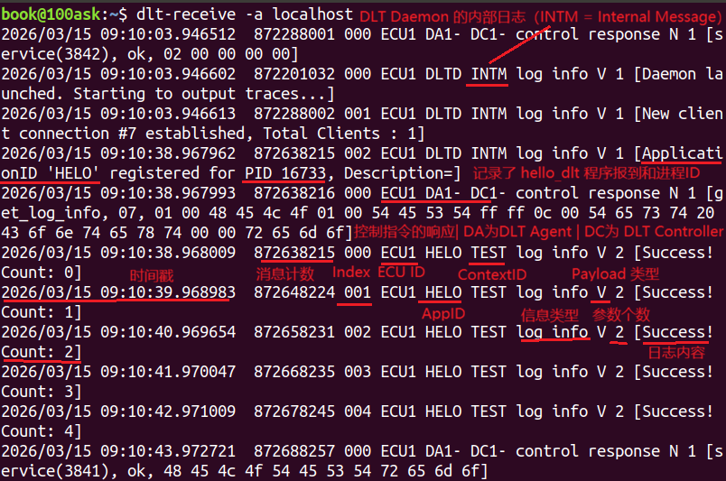
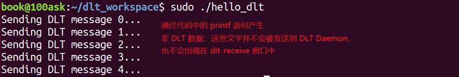

# AUTOSAR-based-DLT-daemon

# 项目介绍

**DLT-daemon** 不仅仅是一个“写日志”的工具，它是车载 Linux 系统中不可或缺的通信中枢。



- **DLT User** 
  - 本质上是一个服务于其各自（与 DLT 无关）目的并生成 DLT 日志消息的应用程序。它利用 DLT 库来制作和传输这些消息。
- **DLT Library**
  - 为 DLT 用户（即应用程序）提供方便的 API，以创建 DLT 日志消息并将其移交给 DLT 守护进程。如果后者不可用，库会将消息缓存在环形缓冲区中，这样它们就不会立即丢失。
- **DLT Daemon** 
  - 是 ECU 的 DLT 通信接口。它收集并缓冲来自 ECU 上运行的一个或多个 DLT 用户的日志消息，并根据 DLT 客户端的请求将其提供给他们。守护进程还接受来自客户端的控制消息以调整守护进程或应用程序的行为。
- **DLT Client** 
  - 通过从 DLT 守护进程获取来自 DLT 用户的日志消息来接收和使用它们。它还可以发出控制消息来控制 DLT 守护程序或其连接的 DLT 用户的行为。 DLT 客户端甚至可以通过所谓的注入消息将用户定义的数据传输给 DLT 用户。


### 项目功能

DLT (Diagnostic Log and Trace) 的核心任务是将分布在不同进程（甚至不同处理器）中的日志，高效、标准化地汇聚并发送到外部调试终端。

- **多源日志汇聚：** 收集来自多个应用程序（Dlt User Apps）的日志和控制信息。
- **标准化格式：** 遵循 AUTOSAR 规范，将日志封装为包含 Header（时间戳、ECU ID、会话 ID）和 Payload 的二进制包。
  - **AUTOSAR**（AUTomotive Open System ARchitecture，汽车开放系统架构） 是由全球各大汽车制造商（如宝马、大众、丰田）和供应商（如博世、大陆）共同制定的一套**汽车电子软件标准** 
  - **核心理念：** **软硬件解耦**。让开发算法的人不用管芯片是哪家的，让做硬件的人只需要提供标准接口
  - AUTOSAR 的层级结构 从下到上分为三层 
    -  **微控制器抽象层 (MCAL)：** 最底层。直接操作硬件寄存器，把芯片的差异常规化。
    - **基础软件层 (BSW)：** 中间层。提供各种服务，比如网络通信（CAN/Ethernet）、内存管理、诊断服务，以及你正在看的 **DLT（Diagnostic Log and Trace）**。
    - **运行环境 (RTE)：** “隔离层”。确保应用层代码不直接接触底层，通过虚拟函数进行通信。
    - **应用软件层 (ASW)：** 最顶层。比如自动驾驶算法、空调控制逻辑等
  - Classic Platform vs. Adaptive Platform 
    - **Classic AUTOSAR (CP):**
      - **运行环境：** 运行在嵌入式 RTOS（如 OSEK）上，通常是单片机（MCU）。
      - **特点：** 实时性极强（毫秒级响应）、高度安全、静态配置。
      - **应用：** 刹车控制、引擎控制、安全气囊。
    - **Adaptive AUTOSAR (AP):**
      - **运行环境：** 运行在 **POSIX 标准的系统**（如 **Linux** 或 QNX）上。
      - **特点：** 面向服务 (SOA)、支持远程更新 (OTA)、算力强大。
      - **应用：** 智能座舱、自动驾驶、车联网
      - **DLT-daemon** 就是 **Adaptive AUTOSAR** 中用于日志记录的标准中间件实现 
  - 为什么 DLT 属于 AUTOSAR？
    - 在汽车开发中，调试非常困难。几十个 ECU（电子控制单元）通过以太网连接，如果某个功能报错，工程师需要一种**统一的格式**来查看所有 ECU 的运行状态
    - AUTOSAR 规定了 DLT 协议：
      - 所有的日志必须有统一的 Header（包含 ID、时间戳、优先级）。
      - 所有的日志必须能通过 DLT 协议导出到外部设备。
      - 这就是为什么 `dlt-daemon` 严格遵守这些规范
  - AUTOSAR 就是汽车界的“标准化语言”。
    - **学习 DLT-daemon** = 掌握了 Adaptive AUTOSAR 中的日志标准。
    - **掌握 AUTOSAR** = 拿到了进入一线车企或 Tier 1 供应商（如华为、经纬恒润、博世）的敲门砖
- **运行时控制：** 支持在不重启程序的情况下，远程动态修改日志级别（如从 INFO 改为 DEBUG）。
- **多种后端传输：** 支持通过 Serial (RS232)、TCP/IP、UDP 或存储到本地文件。
- **非侵入式缓冲：** 当后端连接断开时，日志会暂存在环形缓冲区中，防止数据丢失或阻塞应用。

# 快速复现

## 第一步：安装依赖

```Bash
sudo apt-get update
sudo apt-get install cmake zlib1g-dev libdbus-1-dev g++
```


## 第二步：编译源码

```Bash
# 重新创建并进入工作目录
mkdir -p /home/book/dlt_workspace
cd /home/book/dlt_workspace

# 克隆源码（建议克隆稳定分支）
git clone https://github.com/COVESA/dlt-daemon.git
cd dlt-daemon

# 创建独立的构建文件夹（关键步骤！）
mkdir build
cd build


# 执行 CMake 配置
# cmake ..
# 编译出错：
#	DLT 的代码对较旧版本的 GCC 或者特定的编译检查非常敏感。
#	这次报错是因为 strlen 返回的是 size_t (64位)，而代码尝试将其存入 uint8_t (8位)，
#	触发了类型转换安全检查 (-Werror=conversion)
# 重新配置：通过 -DCMAKE_C_FLAGS 强行插入“不检查转换”和“不视警告为错误”
cmake .. -DWITH_WERROR=OFF -DCMAKE_C_FLAGS="-w"

# 注意：这一步会自动根据 dlt_user.h.in 生成 dlt_user.h
# CMake 这种构建工具的核心逻辑：保护源码目录（Source Tree）的纯净。
# 	当你执行 cmake .. 时，它是以 build 目录作为“车间”的。
#	所有生成的、编译的文件，都不会出现在你的源码目录 (include/dlt) 里
#	而是会出现在 build 目录的对应位置：/dlt_workspace/dlt-daemon/build/include/dlt/
# 标准的“出厂”流程
#	虽然文件现在在 build 里，但我们并不直接从 build 里引用它。标准的做法是：
#		编译 (make)：把源码编译成二进制。
#		安装 (sudo make install)：这一步才是关键！
#		make install 会把：源码目录里的 dlt.h以及 build 目录里生成的 dlt_user.h
#		统一 拷贝到系统的标准位置：/usr/local/include/dlt/


# 编译
# 使用 -j4 加快速度（取决于你的 CPU 核心数）
make -j4


# 编译成功后的最后三步
# 当 make 跑到 100% 后，请务必执行：
# 1. 安装到系统目录
sudo make install
# 2. 刷新动态库缓存（非常重要，否则运行程序会报找不到 libdlt.so）
sudo ldconfig
# 3. 最终验证：查看头文件是否真的“各就各位”了
ls -l /usr/local/include/dlt/dlt_user.h

```


## 第三步：启动测试

现在系统里已经有了标准安装的 DLT 环境。让我们趁热打铁，完成最后一步：**编写并运行一个真正的 HelloWorld 客户端** 


### **编写代码：`hello_dlt.c`** 

- 保持目录整洁，建议把自己的代码放在 `dlt-daemon` 源码目录之外 
- cd /home/book/dlt_workspace 
-  gedit hello_dlt.c

- ```c
  // hello_dlt.c
  #include <dlt.h>
  
  DLT_DECLARE_CONTEXT(hello_ctx);
  
  int main() {
      // 注册应用
      DLT_REGISTER_APP("HELO", "Standard Hello App");
      // 注册上下文
      DLT_REGISTER_CONTEXT(hello_ctx, "TEST", "Test Context");
  
      // 发送一条带变量的日志（模拟数据）
      int count = 0;
      while(count < 5) {
          DLT_LOG(hello_ctx, DLT_LOG_INFO, DLT_STRING("Success! Count:"), DLT_INT(count));
          printf("Sending DLT message %d...\n", count);
          count++;
          sleep(1); 
      }
  
      DLT_UNREGISTER_CONTEXT(hello_ctx);
      DLT_UNREGISTER_APP();
      return 0;
  }
  ```

  

### **gcc编译**

- bash：gcc hello_dlt.c -o hello_dlt -ldlt

- ```bash
  # 报错
  hello_dlt.c:1:10: fatal error: dlt.h: No such file or directory
   #include <dlt.h>
            ^~~~~~~
  compilation terminated.
  
  # 原因
  # 因为在标准安装下，DLT 的头文件通常被放置在 /usr/local/include/dlt/ 这个子目录里
  # 虽然文件在系统路径下，但 GCC 默认只会搜索 /usr/local/include 根目录
  # 它不会自动钻进 dlt/ 文件夹里去找
  
  # 解决办法
  # 方法 A：修改编译命令（推荐，不改代码）
  # 通过 -I 参数显式告诉编译器头文件所在的具体文件夹
  gcc hello_dlt.c -o hello_dlt -I /usr/local/include/dlt -ldlt
  ```

### **运行环境准备**
需要开启三个终端，分别模拟
- 应用端发送控制信息/用户信息
- 中间件dlt-daemon守护进程传递信息
- 客户端接收信息

- #### **终端 A**

  - 模拟dlt-daemon守护进程，传递消息

  - ```bash
    sudo dlt-daemon 
    ```

  - 运行结果如下：包括从启动到建立连接到传送消息

  - 

  - 

  - 

  - 按**时间顺序**，为你逐条拆解上图这些“专业术语”的含义：

    ------

  - **第一阶段：守护进程启动 (Initialization)**

    - **Starting DLT Daemon; DLT Package Version: 3.0.1 STABLE...** 这是 Daemon 的开机自检，确认了你刚编译的版本是 3.0.1。下面的 `-SYSTEMD -SHM` 说明你在编译时关闭了系统集成和共享内存功能（这符合我们之前的简化编译策略）。
    - **FIFO size: 65536** Daemon 开辟了 64KB 的命名管道缓冲区。当你的 App 发送日志太快时，数据会先存在这里。
    - **Listening on ip 0.0.0.0 and port: 3490** **关键点：** Daemon 已经打开了 TCP 网络监听。这意味着不仅是你本机，同一局域网下的其他电脑（比如装了 DLT Viewer 的 Windows）也可以通过 3490 端口看你的日志。
    - **Ringbuffer configuration: 500000/10000000/500000** 这是环形缓冲区设置。如果没有任何接收端连接，Daemon 会在内存中循环存储日志，防止丢失。

    ------

  - **第二阶段：状态切换 (Connection State)**

    - **Switched to buffer state for socket connections.** 启动初期，因为还没有 `dlt-receive` 连接上来，Daemon 处于“缓存模式”：日志只存进内存，不向外发。
    - **Activate connection type: 2** 检测到有外部客户端（即你的终端 B：`dlt-receive`）通过 Socket 连进来了。
    - **Switched to send direct state.** **重要信号：** 因为有了接收端，Daemon 切换到了“直发模式”。现在收到的任何日志都会立即通过网络推送到终端 B。

    ------

  - **第三阶段：你的程序接入 (Application Handshake)**

    这是第二张截图最后一行最硬核的内容，也是证明你程序跑通的证据：

    - **Send log-level to context: HELO:TEST [-1 -> 4]** 这是你的 `hello_dlt` 运行时产生的握手日志：
      - **HELO:TEST**：对应你在代码里写的 AppID (`HELO`) 和 ContextID (`TEST`)。
      - **[-1 -> 4]**：这代表日志级别的同步。`-1` 是初始未知状态，`4` 代表 **DLT_LOG_INFO**。
      - **含义**：Daemon 告诉你的程序：“嘿，我知道你是 HELO 模块的 TEST 上下文了，现在请把 INFO 级别（4）及以上的日志都发给我。”

  - **总结**

    - DLT 客户端和 Daemon 是如何交互的 
      - 首先，Daemon 会初始化 FIFO 管道和网络 Socket。
      - 当客户端（App）启动时，会通过 IPC 注册自己的 AppID。
      - 我在日志中观察到 **Send log-level to context** 的打印，这标志着 App 和 Daemon 成功建立了同步。
      - 此时 Daemon 会下发当前全局定义的日志级别（如 Level 4），App 随后根据这个级别开始按需推送日志流 

- #### 终端 B

  - 模拟client，接收数据

  -  

    ```bash
    dlt-receive -a localhost
    ```

  - 运行结果如下：包括从启动到建立连接到接收消息

  - 

  - **这是 `dlt-receive` 终端捕获到的真实协议数据，信息量非常大**

    我们按照 DLT 的 **标准协议格式** 逐项解释这些打印的含义：

    ------

  - **1. DLT 日志的标准格式拆解**

    以你程序的最后一条日志为例：

    `2026/03/15 09:10:42.971009  872678245 004 ECU1 HELO TEST log info V 2 [Success! Count: 4]`

    | **组成部分**     | **示例内容**                 | **含义**                                                  |
    | ---------------- | ---------------------------- | --------------------------------------------------------- |
    | **时间戳**       | `2026/03/15 09:10:42.971009` | 接收端捕获这条消息的精确时间。                            |
    | **消息计数**     | `872678245`                  | 这是消息的序列号，用于检测日志是否丢包。                  |
    | **Index**        | `004`                        | 本次会话中该 Context 的消息序号（从 0 开始计）。          |
    | **ECU ID**       | `ECU1`                       | 节点标识符（默认是 ECU1）。                               |
    | **AppID**        | **HELO**                     | 对应你代码里的 `DLT_REGISTER_APP("HELO", ...)`。          |
    | **ContextID**    | **TEST**                     | 对应你代码里的 `DLT_REGISTER_CONTEXT(..., "TEST", ...)`。 |
    | **信息类型**     | `log info`                   | 消息级别为 INFO。如果是报错会显示 `log error`。           |
    | **Payload 类型** | `V`                          | **Verbose 模式**，表示消息包含可读的参数描述。            |
    | **参数个数**     | `2`                          | 你的日志由 2 个部分组成：字符串 + 整数。                  |
    | **日志内容**     | `[Success! Count: 4]`        | 最终拼装出来的业务日志数据。                              |

    ------

  - **2. 关键系统消息解释**

    除了你自己的日志，截图里还有几条 DLT 系统产生的“控制消息”，这能体现你对中间件底层逻辑的理解：

    - **DLTD INTM log info ... [Daemon launched...]**
      - 这是 DLT Daemon 自己的内部日志（INTM = Internal Message）。它在告诉所有接收端：“我刚启动，开始输出追踪数据了。”
    - **DLTD INTM log info ... [ApplicationID 'HELO' registered for PID 16733...]**
      - **重要！** 这记录了你的 `hello_dlt` 程序（进程 ID 为 16733）向 Daemon 报到的瞬间。
    - **DA1- DC1- control response N 1 ...**
      - 这是 **控制指令的响应**。
      - `DA1` 代表 DLT Agent，`DC1` 代表 DLT Controller。
      - 当 `dlt-receive` 连上时，它会自动查询当前有哪些 App 在线，这些奇怪的十六进制码就是 Daemon 返回的 App 列表数据。

  - **总结**

    - 在这张 `dlt-receive` 的监控截图中，我们可以看到整个 DLT 链路的生命周期。
    - 首先是 **DLT Daemon** 的初始化，随后是 PID 为 16733 的应用通过 **HELO AppID** 完成了注册。
    - 在业务逻辑部分，程序以 **Verbose 模式** 推送了 5 条日志。通过观察 **Timestamp** 和 **Index (000-004)**，可以确认日志是按照 1 秒为间隔稳定推送的，没有出现丢包（序列号连续）。
    - 此外，最后一行显示的 **control response** 是 DLT 协议内部的控制流，用于同步 ECU 的状态信息，这证明了 Agent 和 Receiver 之间的双向通信是正常的

- #### 终端C

  - 模拟App发送消息，运行先前编译好的hello_dlt

  - ```bash
    sudo ./hello_dlt
    ```

  - 

  - 

  - **DLT 客户端程序（hello_dlt）** 的控制台输出。

    在车载开发中，这种本地终端的打印通常被称为 **Console Log** 或 **Standard Output (stdout)**。它与你刚才在 `dlt-receive` 看到的日志有着本质的区别。下面我为你详细拆解：

    ------

  - **1. 打印内容的含义**

    这些 `Sending DLT message X...` 是通过你代码中的 `printf` 语句产生的：

    - **本地确认**：它存在的唯一目的是告诉你（开发者）：“我的程序没死，循环正在跑，代码逻辑已经执行到了发送日志的那一步。”
    - **非 DLT 数据**：**注意**，这些文字并不会被发送到 DLT Daemon，也不会出现在 `dlt-receive` 窗口中。它们只存在于你当前的这个黑色终端里。

    ------

  - **2. 车载开发的“最佳实践”：双路并行**

    通过这张截图，你实际上演示了一个非常专业的调试场景：

    1. **控制台打印 (printf)**：用于程序运行状态的实时反馈，简单直接，但不带协议格式，通常在量产发布版中会被禁用。
    2. **DLT 日志 (DLT_LOG)**：在后台默默将结构化数据发给 Daemon。它包含时间戳、AppID、模块信息，是可以被长期存储和离线分析的“黑匣子数据”。

  - **总结**

    - 在开发 DLT 客户端时，我通过 **Console stdout 与 DLT 日志双重校验** 的方式验证了消息发送的实时性。
    - 本地控制台用于实时观察程序循环状态，而 DLT 协议流则通过 DLT-Daemon 转发至接收端，确保了业务逻辑与系统日志监控的同步解耦 
